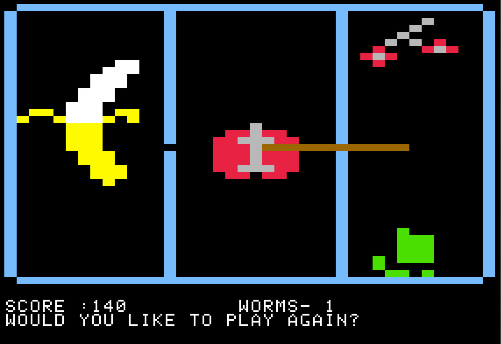

Programming is fun for the Apple
================================

In 1985, I wrote a book about programming for a school project.  I redescovered it recently after years of being stored and forgotten.  It describes how to program using Applesoft BASIC on an Apple ][+.

I could remember spending hours as a child programming on the Apple but could 
not remember as an adult developer how it worked.  The book has an appendix with 
some programs, the largest of which called "WORM ATTACK!", After a few edits I was able to get it working and the code is posted here.  Simply paste into your favorite Apple ][+ emulator and enjoy.

Controls for the game are just left and right arrow to turn the worm left and right.

-Mark

